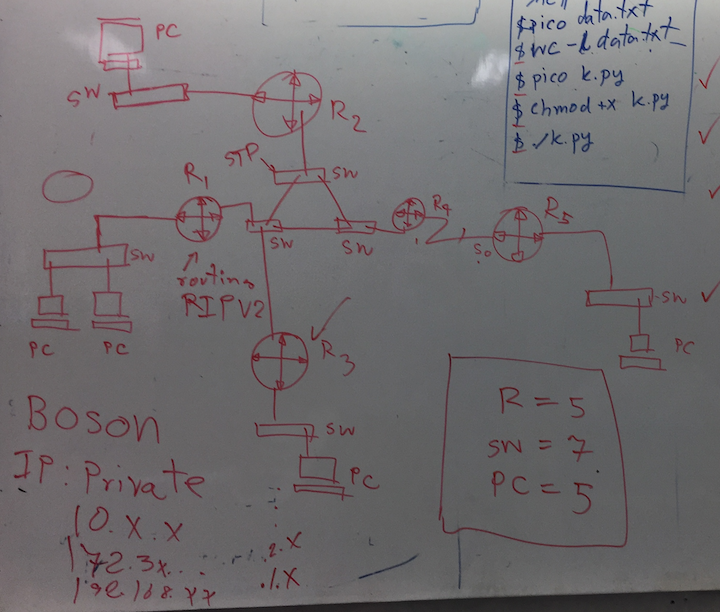

## ออกแบบเครือข่ายคอมพิวเตอร์ ตามเงื่อนไขต่อไปนี้

### มีอุปกรณ์เครือข่ายต่อไปนี้
* เราท์เตอร์ไม่น้อยกว่า 5 เครื่อง
* สวิตช์ไม่น้อยกว่า 7 เครื่อง
* คอมพิวเตอร์ไม่น้อยกว่า 5 เครื่อง

### เงื่อนไขการออกแบบ
* มีสวิตช์เชื่อมแบบลูป ไม่น้อยกว่า 1 ลูป
* ใช้ IPv4 ออกแแบบเครือข่ายไม่น้อยกว่า 6 เครือข่าย

### ส่งงาน 25 เมษายน 2562 
* ส่ง Network Diagram + Network IP (50%)
* ตอบคำถามในวันสอบ  (50%)

### ตัวอย่าง network diagram (ขาดหมายเลข IP)

